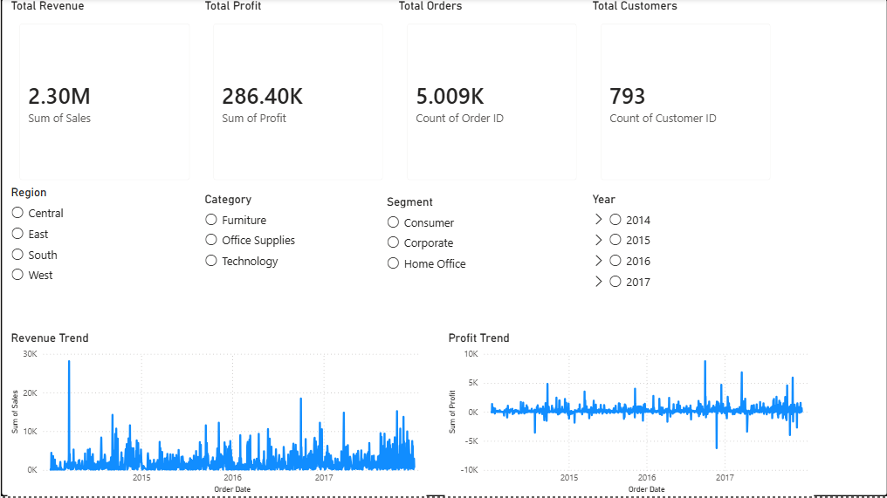
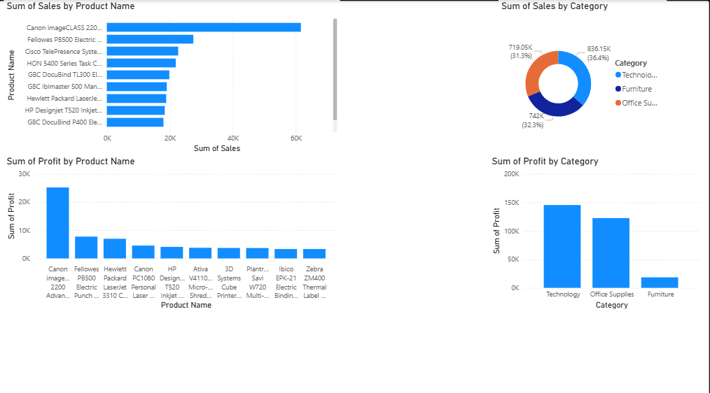
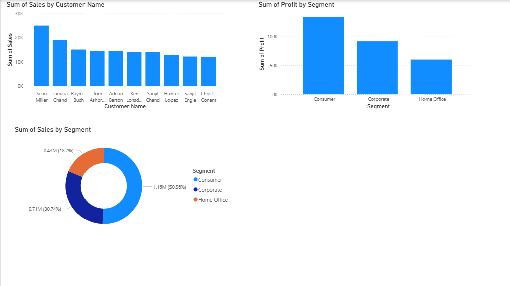
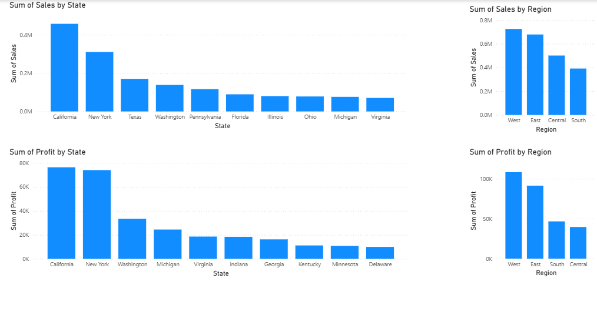

# Retail Sales Analysis

## Project Overview

This project analyzes retail sales performance using SQL and Power BI.

The objective is to identify:

- Revenue trends
- Profitability drivers
- Top products
- Customer segments
- Regional performance

---

## Tools Used

- MySQL
- SQL
- Power BI
- Excel

---

## Dashboard Preview

### Executive Summary

---

### Product Analysis

---

### Customer Analysis

---

### Regional Analysis

---

## Key Business Insights

### Executive Summary

- Total Revenue: 2.30M USD
- Total Profit: 286K USD
- Total Orders: 5,009
- Total Customers: 793

Revenue and profit show an overall increasing trend from 2014 to 2017.

### Product Analysis

- Technology generates the highest revenue.
- Technology also contributes the highest profit.
- Canon imageCLASS is the best-performing product.

### Customer Analysis

- Consumer segment contributes over 50% of total revenue.
- Corporate is the second largest segment.
- Revenue is highly concentrated among a small group of customers.

### Regional Analysis

- West region generates the highest revenue and profit.
- California is the strongest-performing state.
- East region ranks second in both revenue and profit.

---

## Files

- sales_analysis.sql
- TEST.pbix
- Sample-Superstore.csv
